# Hi there 👋

<!-- ## I'm -->

<!-- Backend developer with an engineering mindset, focused on reliable systems and clean architecture.
Interested in physics and medicine as disciplines where precision, causality, and verification matter.
Currently focused on backend systems, performance, and system design. -->

> _I, I went to front(end) and back(end)_  
> _To find myself on track_  
> _I broke the code, woah-oh-oh_

— _adapted from "The Code" by Nemo_

---

## Tech stack

**Languages:** Python · TypeScript · JavaScript · Bash · SQL  
**Backend:** FastAPI · Flask · Node.js · Express · NestJS  
**Data:** PostgreSQL · MongoDB · Redis · SQLite  
**AI:** LLM integrations (Ollama · Hugging Face · Claude · Groq)  
**Infra:** Linux · Docker · GitHub Actions

---

## Currently working on

<!-- AUTO: active-repos:START -->
| Project | Description | Language |
| ------- | ----------- | -------- |
| [`remote-compiler`](https://github.com/whaiman/remote-compiler) | Lightweight secure remote C/C++ compiler with end-to-end encryption for offloading builds from resource-constrained devices to powerful servers | `Python` |
| [`typecore`](https://github.com/whaiman/typecore) | Header-only C++17 library for automatic runtime type detection from strings | `C++` |
| [`adaptive-optical-modulation-ai`](https://github.com/whaiman/adaptive-optical-modulation-ai) | This repository contains the reference implementation of the Adaptive Optical Modulation method | - |
| [`ping-pong-protocol`](https://github.com/whaiman/ping-pong-protocol) | Lightweight LAN discovery and secure communication protocol based on a ping–pong handshake | - |
| [`public-appeal-service`](https://github.com/whaiman/public-appeal-service) | A REST API for managing citizen appeals to government agencies - with AI-powered classification, role-based access control, and Redis caching. | `TypeScript` |
<!-- AUTO: active-repos:END -->

---

## Popular projects

<!-- AUTO: top-repos:START -->
| Project | Description | Language | Stars | Forks |
| ------- | ----------- | -------- | ----- | ----- |
| [`ping-pong-protocol`](https://github.com/whaiman/ping-pong-protocol) | Lightweight LAN discovery and secure communication protocol based on a ping–pong handshake | - | ★ 2 | - |
| [`public-appeal-service`](https://github.com/whaiman/public-appeal-service) | A REST API for managing citizen appeals to government agencies - with AI-powered classification, role-based access control, and Redis caching. | `TypeScript` | ★ 2 | - |
| [`FileServer`](https://github.com/whaiman/FileServer) | - | - | ★ 1 | - |
<!-- AUTO: top-repos:END -->

---

<!-- ## Research

Working on two papers, code will be published here alongside each:

- **Orbital & free-space mechanics** — computing object motion in open space under zero-gravity conditions
- **Adaptive optical modulation using AI** — AI-driven modulation schemes for telecommunications -->

---

## Stats

---

## Principles

I prefer human-driven problem solving and first-principles engineering over generative code or text synthesis.  
I use generative AI only where it serves as a tool for testing, validation, or integrated product functionality, not as a substitute for authorship or engineering judgment.

---

## Contact

