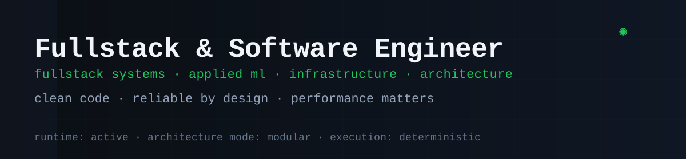
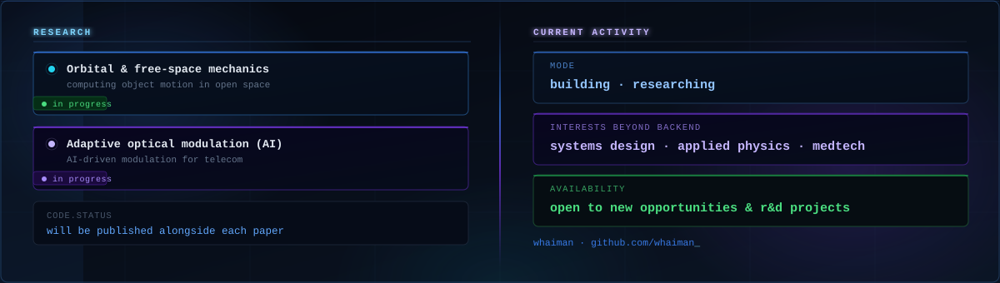

# Hi there 👋

> _I, I went to front(end) and back(end)_  
> _To find myself on track_  
> _I broke the code, woah-oh-oh_

— _adapted from "The Code" by Nemo_

---

## Tech stack

**Languages:** Python · TypeScript · JavaScript · Bash · SQL  
**Frameworks:** FastAPI · Flask · Node.js · Express · NestJS · Next.js · React.js
**Data:** PostgreSQL · MongoDB · Redis · SQLite · Supabase
**AI:** OpenAI · Claude · Hugging Face · OpenRouter · Groq
**Infra:** Linux · Docker · GitHub Actions

---

## Currently working on

<!-- AUTO: active-repos:START -->
| Project | Description | Language |
| ------- | ----------- | -------- |
| [`remote-compiler`](https://github.com/whaiman/remote-compiler) | Lightweight secure remote C/C++ compiler with end-to-end encryption for offloading builds from resource-constrained devices to powerful servers | `Python` |
| [`typecore`](https://github.com/whaiman/typecore) | Header-only C++17 library for automatic runtime type detection from strings | `C++` |
| [`adaptive-optical-modulation-ai`](https://github.com/whaiman/adaptive-optical-modulation-ai) | This repository contains the reference implementation of the Adaptive Optical Modulation method | - |
| [`public-appeal-service`](https://github.com/whaiman/public-appeal-service) | A REST API for managing citizen appeals to government agencies - with AI-powered classification, role-based access control, and Redis caching. | `TypeScript` |
| [`ping-pong-protocol`](https://github.com/whaiman/ping-pong-protocol) | Lightweight LAN discovery and secure communication protocol based on a ping–pong handshake | - |
| [`cache-store`](https://github.com/whaiman/cache-store) | A minimal in-memory TCP key–value cache with TTL, binary protocol and event loop. | - |
<!-- AUTO: active-repos:END -->

---

## Popular projects

<!-- AUTO: top-repos:START -->
| Project | Description | Language | Stars | Forks |
| ------- | ----------- | -------- | ----- | ----- |
| [`kiosk`](https://github.com/whaiman/kiosk) | A terminal RSS/Atom reader built with Textual. Stop by, read, move on - no tracking, no algorithm, no account. | `Python` | ★ 3 | - |
| [`public-appeal-service`](https://github.com/whaiman/public-appeal-service) | A REST API for managing citizen appeals to government agencies - with AI-powered classification, role-based access control, and Redis caching. | `TypeScript` | ★ 2 | - |
| [`ping-pong-protocol`](https://github.com/whaiman/ping-pong-protocol) | Lightweight LAN discovery and secure communication protocol based on a ping–pong handshake | - | ★ 2 | - |
<!-- AUTO: top-repos:END -->

---

---

## Stats

---

## Principles

I prefer human-driven problem solving and first-principles engineering over generative code or text synthesis.  
I use generative AI only where it serves as a tool for testing, validation, or integrated product functionality, not as a substitute for authorship or engineering judgment.

---

## Contact

